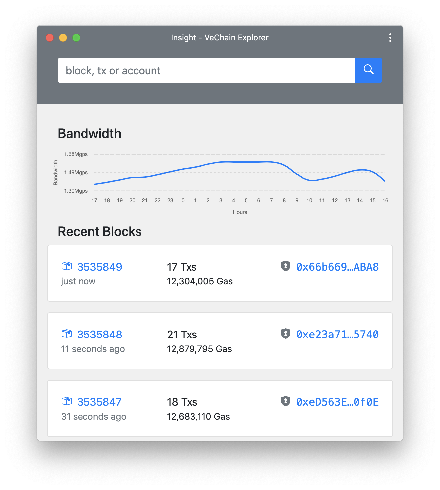

# VeChain Insight

> Insight is a **serverless** VeChain explorer. It allows you to explore and search for blocks, transactions and accounts.

[Try it out!](https://insight.vecha.in/#/)

## Permanent links

- Main net - `https://insight.vecha.in/#/main/txs/{txid}`
- Test net - `https://insight.vecha.in/#/test/txs/{txid}`

## Screenshots



## Project setup

### Install dependencies

```
yarn
```

### Compiles with hot-reload for development

```
yarn serve
```

### Compiles and minifies for production

```
yarn build
```

## Build and run with Docker

```
docker build -t insight-app .
```

```
docker run -dp 127.0.0.1:8080:80 insight-app
```

or with docker compose

```
docker compose up -d --build
```

## Contributing

Everyone is always welcome to contribute on the codebase.
