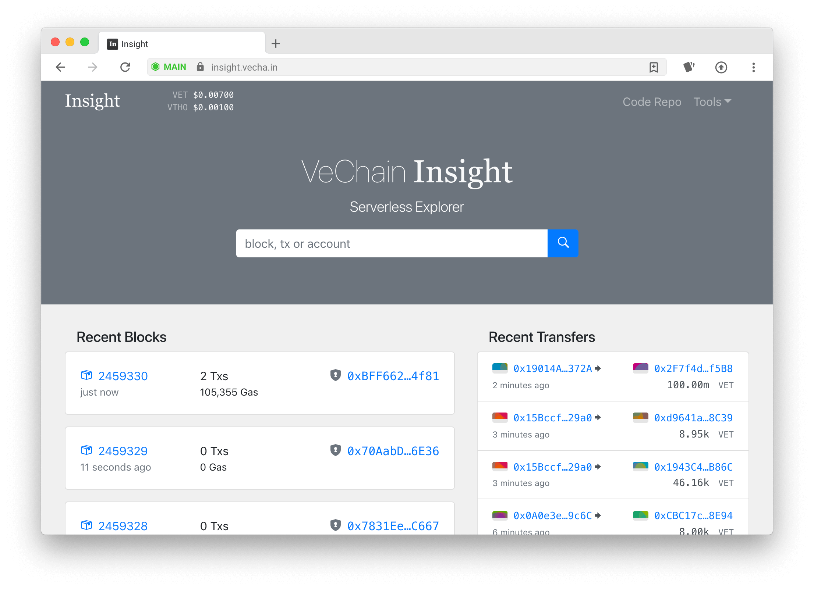
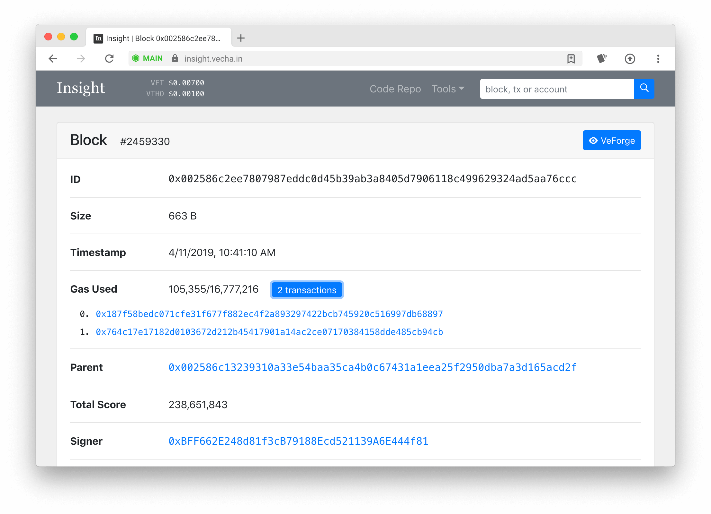
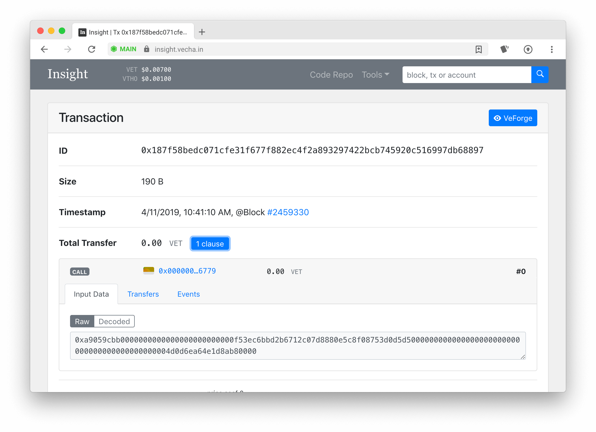

# VeChain Insight

> Insight is a **serverless** VeChain explorer. It allows you to explore and search for blocks, transactions and accounts. 

[Try it out!](https://insight.vecha.in/#/)

## Screenshots







## Project setup
```
npm install
```

### Compiles and hot-reloads for development
```
npm run serve
```

### Compiles and minifies for production
```
npm run build
```

## Contributing

Everyone is always welcome to contribute on the codebase.
